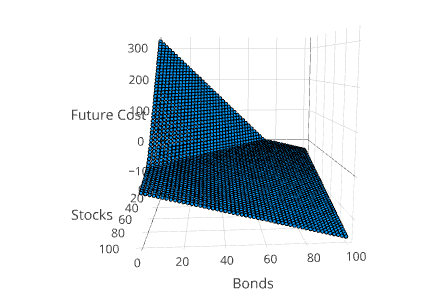

```@meta
CurrentModule = SDDP
```

## Overview
*SDDP.jl - Stochastic Dual Dynamic Programming in Julia.*

SDDP.jl is a package for solving large multi-stage convex stocastic optimization
problems. In this manual, we're going to assume a reasonable amount of background
knowledge about stochastic optimization, the SDDP algorithm, Julia, and JuMP.

!!! note
    If you don't have that background, you may want to brush up on some
    [reading material](readings.html).


### Types of problems SDDP.jl can solve

To start, lets discuss the types of problems SDDP.jl can solve, since it has a
few features that are non-standard, and it is missing some features that are
standard.

SDDP.jl can solve multi-stage convex stochastic optimizations problems with
 - a finite discrete number of states;
 - continuous state and control variables;
 - Hazard-Decision (Wait-and-See) uncertainty realization;
 - stagewise independent uncertainty in the RHS of the constraints that is
    drawn from a finite discrete distribution;
 - stagewise independent uncertainty in the objective function that is
    drawn from a finite discrete distribution;
 - a markov chain for temporal dependence. The markov chain forms a directed,
    acyclic, feed-forward graph with a finite (and at least one) number of
    markov states in each stage.

!!! note
    Stagewise independent uncertainty in the constraint coefficients is **not**
    supported. You should reformulate the problem, or model the uncertainty as
    a markov chain.

In this manual, we detail the many features of SDDP.jl through the classic
example of balancing a portfolio of stocks and bonds over time.

## Getting started

This package is unregistered so you will need to `Pkg.clone` it as follows:

```julia
Pkg.clone("https://github.com/odow/SDDP.jl.git")
```

If you want to use the parallel features of SDDP.jl, you should start Julia with
some worker processes (`julia -p N`), or add by running `julia> addprocs(N)` in
a running Julia session.

## Formulating the problem

... still to do ...

For now, go look at the examples.

### The Asset Management Problem

The goal of the asset management problem is to choose an investment portfolio
that is composed of stocks and bonds in order to meet a target wealth goal at
the end of the time horizon. After five, and ten years, the agent observes the
portfolio and is able to re-balance their wealth between the two asset classes.
As an extension to the original problem, we introduce two new random variables.
The first that represents a source of additional wealth in years 5 and 10. The
second is an immediate reward that the agent incurs for holding stocks at the
end of years 5 and 10. This can be though of as a dividend that cannot be
reinvested.

## Communicating the problem to the solver

The second step in the optimization process is communicating the problem to the
solver. To do this, we are going to build each subproblem as a JuMP model, and
provide some metadata that describes how the JuMP subproblems inter-relate.

### The Model Constructor

The core type of SDDP.jl is the [`SDDPModel`](@ref) object. It can be constructed with
```julia
m = SDDPModel( ... metadata as keyword arguments ... ) do sp, t, i
    ... JuMP subproblem definition ...
end
```
We draw the readers attention to three sections in the SDDPModel constructor.

#### Keyword Metadata

For a comprehensive list of options, checkout the [SDDPModel API](apireference.html#SDDP.SDDPModel)
or type `julia> ? SDDPModel` into a Julia REPL. However, we'll briefly list the
important ones here.

**Required Keyword arguments**

 * `stages::Int`: the number of stages in the problem. A stage is defined as
    each step in time at which a decion can be made. Defaults to `1`.

 * `objective_bound::Float64`: a valid bound on the initial value/cost to go.
   i.e. for maximisation this may be some large positive number, for
   minimisation this may be some large negative number.

 * `solver::MathProgBase.AbstractMathProgSolver`: any MathProgBase compliant
   solver that returns duals from a linear program. If this isn't specified then
   you must use `JuMP.setsolver(sp, solver)` in the stage definition.

**Optional Keyword arguments**

 * `sense`: must be either `:Max` or `:Min`. Defaults to `:Min`.

 * `cut_oracle`: the cut oracle is responsible for collecting and storing the
   cuts that define a value function. The cut oracle may decide that only a
   subset of the total discovered cuts are relevant, which improves solution
   speed by reducing the size of the subproblems that need solving. Currently
   must be one of
     * `DefaultCutOracle()` (see [`DefaultCutOracle`](@ref) for explanation)
     * `LevelOneCutOracle()`(see [`LevelOneCutOracle`](@ref) for explanation)

 * `risk_measure`: if a single risk measure is given (i.e.
    `risk_measure = Expectation()`), then this measure will be applied to every
    stage in the problem. Another option is to provide a vector of risk
    measures. There must be one element for every stage. For example:

```julia
risk_measure = [ NestedAVaR(lambda=0.5, beta=0.25), Expectation() ]
```

   will apply the `i`'th element of `risk_measure` to every Markov state in the
   `i`'th stage. The last option is to provide a vector (one element for each
   stage) of vectors of risk measures (one for each Markov state in the stage).
   For example:

```julia
risk_measure = [
# Stage 1 Markov 1 # Stage 1 Markov 2 #
   [ Expectation(), Expectation() ],
   # ------- Stage 2 Markov 1 ------- ## ------- Stage 2 Markov 2 ------- #
   [ NestedAVaR(lambda=0.5, beta=0.25), NestedAVaR(lambda=0.25, beta=0.3) ]
   ]
```

   Note that even though the last stage does not have a future cost function
   associated with it (as it has no children), we still have to specify a risk
   measure. This is necessary to simplify the implementation of the algorithm.

   For more help see [`NestedAVaR`](@ref) or [`Expectation`](@ref).

 * `markov_transition`: define the transition probabilties of the stage graph.
   If a single array is given, it is assumed that there is an equal number of
   Markov states in each stage and the transition probabilities are stage
   invariant. Row indices represent the Markov state in the previous stage.
   Column indices represent the Markov state in the current stage. Therefore:

```julia
markov_transition = [0.1 0.9; 0.8 0.2]
```

   is the transition matrix when there is 10% chance of transitioning from Markov
   state 1 to Markov state 1, a 90% chance of transitioning from Markov state 1
   to Markov state 2, an 80% chance of transitioning from Markov state 2 to Markov
   state 1, and a 20% chance of transitioning from Markov state 2 to Markov state 2.

#### do sp, t, i ... end

This constructor is just syntactic sugar to make the process of defining a model
a little tidier. It's nothing special to SDDP.jl and many users will be familiar
with it (for example, the `open(file, "w") do io ... end` syntax for file IO).

An anonymous function with three arguments (`sp`, `t` and `i`, although these
can be named arbitrarily) is constructed. The body of the function should build
the subproblem as the JuMP model `sp` for stage `t` and markov state `i`. `t` is
an integer that ranges from 1 to the number of stages. `i` is also an integer
that ranges from 1 to the number of markov states in stage `t`.

Users are also free to explicitly construct a function that
takes three arguments, and pass that as the first argument to [`SDDPModel`](@ref), along
with the keyword arguments. For example:

```julia
function buildsubproblem!(sp::JuMP.Model, t::Int, i::Int)
    ... define states etc. ...
end
m = SDDPModel(buildsubproblem!; ... metadata as keyword arguments ...)
```

!!! note
    If you don't have any markov states in the model, you don't have to include
    the third argument in the constructor. `SDDPModel() do sp, t ... end` is
    also valid syntax.

#### JuMP Subproblem

In the next sections, we explain in detail how for model state variables,
constraints, the stage objective, and any uncertainties in the model. However,
you should keep a few things in mind:

1. the body of the `do sp, t, i ... end` block is just a normal Julia function
   body. As such, standard scoping rules apply.
2. you can use `t` and `i` whenever, and however, you like. For example:
```julia
m = SDDPModel() do sp, t, i
    if t == 1
        # do something in the first stage only
    else
        # do something in the other stages
    end
end
```
 3. `sp` is just a normal JuMP model. You could (if so desired), set the solve
    hook, or add quadratic constraints (provided you have a quadratic solver).

### State Variables

We can define a new state variable in the stage problem `sp` using the [`@state`](@ref)
macro:

```julia
@state(sp, x >= 0.5, x0==1)
```
The second argument (`x`) refers to the outgoing state variable (i.e. the value
at the end of the stage). The third argument (`x0`) refers to the incoming state
variable (i.e. the value at the beginning of the stage). For users familiar with
SDDP, SDDP.jl handles all the calculation of the dual variables needed to evaluate
the cuts automatically behind the scenes.

The [`@state`](@ref) macro is just short-hand for writing:
```julia
@variable(sp, x >= 0.5)
@variable(sp, x0, start=1)
SDDP.statevariable!(sp, x0, x)
```

!!! note
    The `start=1` is only every used behind the scenes by the first stage problem.
    It's really just a nice syntatic trick we use to make specifying the model a
    bit more compact.

This illustrates how we can use indexing just as we would in a JuMP `@variable`
macro:

```julia
X0 = [3.0, 2.0]
@state(sp, x[i=1:2], x0==X0[i])
```

In this case, both `x` and `x0` are JuMP dicts that can be indexed with the keys
`1` and `2`. All the indices must be specified in the second argument, but they
can be referred to in the third argument. The indexing of `x0` will be identical
to that of `x.`

There is also a plural version of the [`@state`](@ref) macro:
```julia
@states(sp, begin
    x >= 0.0, x0==1
    y >= 0.0, y0==1
end)
```

### Standard JuMP machinery

Remember that `sp` is just a normal JuMP model, and so (almost) anything you can
do in JuMP, you can do in SDDP.jl. The one exception is the objective, which we
detail in the next section.

However, control variables are just normal JuMP variables and can be created
using `@variable` or `@variables`. Dynamical constraints, and feasiblity sets
can be specified using `@constraint` or `@constraints`.

### The stage objective

If there is no stagewise independent uncertainty in the objective, then the
stage objective (i.e. ignoring the future cost) can be set via the
[`@stageobjective`](@ref) macro. This is similar to the JuMP `@objective` macro, but
without the sense argument. For example:

```julia
@stageobjective(sp, obj)
```

If there is stagewise independent noise in the objective, we add an additional
argument to [`@stageobjective`](@ref) that has the form `kw=realizations`.

`kw` is a symbol that can appear anywhere in `obj`, and `realizations` is a
vector of realizations of the uncertainty. For example:

```julia
@stageobjective(sp, kw=realizations, obj)
setnoiseprobability!(sp, [0.2, 0.3, 0.5])
```
[`setnoiseprobability!`](@ref) can be used to specify the finite discrete distribution
of the realizations (it must sum to 1.0). If you don't explicitly call
[`setnoiseprobability!`](@ref), the distribution is assumed to be uniform.

Other examples include:
```julia
# noise is a coefficient
@stageobjective(sp, c=[1.0, 2.0, 3.0], c * x)
# noise is used to index a variable
@stageobjective(sp, i=[1,2,3], 2 * x[i])
```

### Dynamics with linear noise

SDDP.jl also supports uncertainty in the right-hand-side of constraints. Instead
of using the JuMP `@constraint` macro, we need to use the [`@rhsnoise`](@ref) macro:

```julia
@rhsnoise(sp, w=[1,2,3], x <= w)
setnoiseprobability!(sp, [0.2, 0.3, 0.5])
```

Compared to `@constraint`, there are a couple of notable differences:
 - indexing is **not** supported;
 - the second argument is a `kw=realizations` key-value pair like the `@stageobjective`;
 - the `kw` can on either side of the constraint as written, but when normalised
    to an Ax <= b form, it must only appear in the b vector.

Multiple [`@rhsnoise`](@ref) constraints can be added, however they must have an identical
number of elements in the `realizations` vector.

For example, the following are invalid in SDDP:

```julia
# noise appears as a variable coefficient
@rhsnoise(sp, w=[1,2,3], w * x <= 1)

# JuMP style indexing
@rhsnoise(sp, w=[1,2,3], [i=1:10; mod(i, 2) == 0], x[i] <= w)

# noises have different number of realizations
@rhsnoise(sp, w=[1,2,3], x <= w)
@rhsnoise(sp, w=[2,3],   x >= w-1)
```

!!! note
    Noises in the constraints are sampled with the noise in the objective.
    Therefore, there should be the same number of elements in the realizations
    for the stage objective, as there are in the constraint noise.

There is also a plural form of the [`@rhsnoise`](@ref) macro:

```julia
@rhsnoises(sp, w=[1,2,3], begin
    x <= w
    x >= w-1
end)
setnoiseprobability!(sp, [0.2, 0.3, 0.5])
```

### Asset Management Example

We now have all the information necessary to define the Asset Management example
in SDDP.jl:

```julia
using SDDP, JuMP, Clp

m = SDDPModel(
               # we are minimizing
                sense = :Min,
               # there are 4 stages
               stages = 4,
               # a large negative value
      objective_bound = -1000.0,
               # a MathOptBase compatible solver
               solver = ClpSolver(),
               # transition probabilities of the lattice
    markov_transition = Array{Float64, 2}[
                        [1.0]',
                        [0.5 0.5],
                        [0.5 0.5; 0.5 0.5],
                        [0.5 0.5; 0.5 0.5]
                    ],
               # risk measures for each stage
         risk_measure = [
                        Expectation(),
                        Expectation(),
                        NestedAVaR(lambda = 0.5, beta=0.5),
                        Expectation()
                    ]
                            ) do sp, t, i
    # Data used in the problem
    ωs = [1.25, 1.06]
    ωb = [1.14, 1.12]
    Φ  = [-1, 5]
    Ψ  = [0.02, 0.0]

    # state variables
    @states(sp, begin
        xs >= 0, xsbar==0
        xb >= 0, xbbar==0
    end)

    if t == 1 # we can switch based on the stage
        # a constraint without noise
        @constraint(sp, xs + xb == 55 + xsbar + xbbar)
        # an objective without noise
        @stageobjective(sp, 0)
    elseif t == 2 || t == 3
        # a constraint with noisein the RHS
        @rhsnoise(sp, φ=Φ, ωs[i] * xsbar + ωb[i] * xbbar + φ == xs + xb)
        # an objective with noise
        @stageobjective(sp, ψ = Ψ, -ψ * xs)
        # noise will be sampled as (Φ[1], Ψ[1]) w.p. 0.6, (Φ[2], Ψ[2]) w.p. 0.4
        setnoiseprobability!(sp, [0.6, 0.4])
    else # when t == 4
        # some control variables
        @variable(sp, u >= 0)
        @variable(sp, v >= 0)
        # dynamics constraint
        @constraint(sp, ωs[i] * xsbar + ωb[i] * xbbar + u - v == 80)
        # an objective without noise
        @stageobjective(sp, 4u - v)
    end
end
```

## Solving the problem efficiently

## Understanding the solution

### Simulating the policy

You can perform a Monte-Carlo simulation of the policy using the [`simulate`](@ref)
function:
```julia
simulationresults = simulate(m, 100, [:xs, :xb])
```

`simulationresults` is a vector of dictionaries (one for each simulation). It has,
as keys, a vector (with one element for each stage) of the optimal solution of
`xs` and `xb`. For example, to query the value of `xs` in the third stage of the
tenth simulation, we can call:

```julia
simulationresults[10][:xs][3]
```

Alternatively, you can peform one simulation with a given realization for the
Markov and stagewise independent noises:
```julia
simulationresults = simulate(m, [:xs], markov=[1,2,1,1], noise=[1,2,2,3])
```

### Visualizing the policy simulation
First, we create a new plotting object with [`SDDP.newplot()`](@ref). Next, we
can add any number of subplots to the visualization via the [`SDDP.addplot!`](@ref)
function. Finally, we can launch a web browser to display the plot with [`SDDP.show`](@ref).

See the [`SDDP.addplot!`](@ref) documentation for more detail.

### Visualizing the Value Function

Another way to understand the solution is to project the value function into 3
dimensions. This can be done using the method [`SDDP.plotvaluefunction`](@ref).

```julia
SDDP.plotvaluefunction(m, 1, 1, 0:1.0:100, 0:1.0:100;
    label1="Stocks", label2="Bonds")
```

This will open up a web browser and display a Plotly figure that looks similar to


## Saving models

Saving a model is as simple as calling:
```julia
SDDP.savemodel!("<filename>", m)
```

Later, you can run:
```julia
m = SDDP.loadmodel("<filename>")
```

!!! note
    [`SDDP.savemodel!`](@ref) relies on the base Julia `serialize` function. This
    is not backwards compatible with previous versions of Julia, or guaranteed to
    be forward compatible with future versions. You should only use this to save
    models for short periods of time. Don't save a model you want to come back to
    in a year.

Another (more persistent) method is to use the `cut_output_file` keyword option
in [`SDDP.solve`](@ref). This will create a csv file containing a list of all
the cuts. These can be loaded at a later date using

```julia
SDDP.loadcuts!(m, "<filename>")
```

## Extras for experts

### New risk measures

SDDP.jl makes it easy to create new risk measures. First, create a new subtype
of the abstract type [`SDDP.AbstractRiskMeasure`](@ref):

```julia
immutable MyNewRiskMeasure <: SDDP.AbstractRiskMeasure
end
```

Then, overload the method [`SDDP.modifyprobability!`](@ref) for your new type.
[`SDDP.modifyprobability!`](@ref) has the following signature:

```julia
SDDP.modifyprobability!(
        measure::AbstractRiskMeasure,
        riskadjusted_distribution,
        original_distribution::Vector{Float64},
        observations::Vector{Float64},
        m::SDDPModel,
        sp::JuMP.Model
)
```
where `original_distribution` contains the risk netural probability of each
outcome in `observations` occurring (so that the probability of `observations[i]`
is `original_distribution[i]`). The method should modify (in-place) the elements
of `riskadjusted_distribution` to represent the risk-adjusted probabilities of
the distribution.

To illustrate this, we shall define the worst-case riskmeasure (which places all
the probability on the worst outcome):

```julia
immutable WorstCase <: SDDP.AbstractRiskMeasure end
function SDDP.modifyprobability!(measure::WorstCase,
        riskadjusted_distribution,
        original_distribution::Vector{Float64},
        observations::Vector{Float64},
        m::SDDPModel,
        sp::JuMP.Model
    )
    if JuMP.getobjectivesense(sp) == :Min
        # if minimizing, worst is the maximum outcome
        idx = indmax(observations)
    else
        # if maximizing, worst is the minimum outcome
        idx = indmin(observations)
    end
    # zero all probabilities
    riskadjusted_distribution .= 0.0
    # set worst to 1.0
    riskadjusted_distribution[idx] = 1.0
    # return
    return nothing
end
```

The risk measure `WorstCase()` can now be used in any SDDP model.

!!! note
    This method gets called a lot, so the usual Julia performance tips apply.

### New cut oracles
