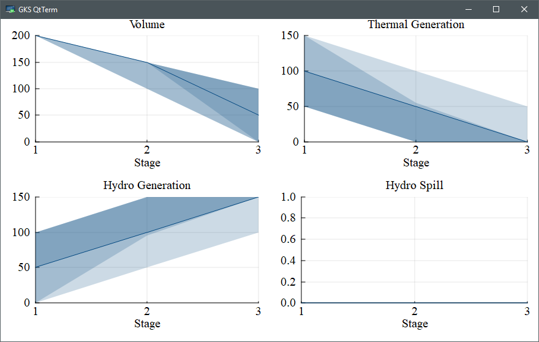

```@meta
CurrentModule = Kokako
```

# Basic V: plotting

In our previous tutorials, we formulated, solved, and simulated multistage
stochastic optimization problems. However, we haven't really investigated what
the solution looks like. Luckily, `SDDP.jl` includes a number of plotting
tools to help us do that. In this tutorial, we explain the tools and make some
pretty pictures.

## Preliminaries

First, we need to create a policy and simulate some trajectories. So, let's take
the model from  [Basic IV: Markov uncertainty](@ref), train it for 20
iterations, and then simulate 100 Monte Carlo realizations of the policy.

```jldoctest tutorial_five
using Kokako, GLPK
Ω = [
    (inflow = 0.0, fuel_multiplier = 1.5),
    (inflow = 50.0, fuel_multiplier = 1.0),
    (inflow = 100.0, fuel_multiplier = 0.75)
]
model = Kokako.MarkovianPolicyGraph(
            transition_matrices = Array{Float64, 2}[
                [1.0]', [0.75 0.25], [0.75 0.25 ; 0.25 0.75]],
            sense = :Min, lower_bound = 0.0,
            optimizer = with_optimizer(GLPK.Optimizer)
        ) do subproblem, node
    t, markov_state = node
    @variable(subproblem, 0 <= volume <= 200, Kokako.State, initial_value = 200)
    @variable(subproblem, thermal_generation >= 0)
    @variable(subproblem, hydro_generation >= 0)
    @variable(subproblem, hydro_spill >= 0)
    @variable(subproblem, inflow)
    @constraint(subproblem,
        volume.out == volume.in + inflow - hydro_generation - hydro_spill)
    @constraint(subproblem, thermal_generation + hydro_generation == 150.0)
    probability = markov_state == 1 ? [1/6, 1/3, 1/2] : [1/2, 1/3, 1/6]
    fuel_cost = [50.0, 100.0, 150.0]
    Kokako.parameterize(subproblem, Ω, probability) do ω
        JuMP.fix(inflow, ω.inflow)
        @stageobjective(subproblem,
            ω.fuel_multiplier * fuel_cost[t] * thermal_generation)
    end
end

Kokako.train(model, iteration_limit = 20, perform_numerical_stability_check = false)

simulations = Kokako.simulate(
    model, 100,
    [:volume, :thermal_generation, :hydro_generation, :hydro_spill])

println("Completed $(length(simulations)) simulations.")

# output

----------------------------------------------------
         SDDP.jl (c) Oscar Dowson, 2017-19

 Iteration   Simulation      Bound        Time (s)
         1   2.25000e+04   5.58840e+03   7.99000e-01
         2   2.85682e+04   7.97534e+03   8.09000e-01
         3   2.55645e+04   8.07292e+03   8.11000e-01
         4   1.31250e+04   8.07292e+03   8.13000e-01
         5   5.00000e+03   8.07292e+03   8.14000e-01
         6   1.12500e+04   8.07292e+03   8.15000e-01
         7   1.12500e+04   8.07292e+03   8.17000e-01
         8   1.87500e+03   8.07292e+03   8.18000e-01
         9   1.87500e+03   8.07292e+03   8.20000e-01
        10   1.87500e+03   8.07292e+03   8.21000e-01
        11   9.37500e+03   8.07292e+03   8.23000e-01
        12   5.00000e+03   8.07292e+03   8.24000e-01
        13   1.25000e+04   8.07292e+03   8.26000e-01
        14   1.87500e+03   8.07292e+03   8.27000e-01
        15   1.87500e+03   8.07292e+03   8.29000e-01
        16   1.87500e+03   8.07292e+03   8.30000e-01
        17   5.00000e+03   8.07292e+03   8.32000e-01
        18   1.87500e+03   8.07292e+03   8.33000e-01
        19   2.43750e+04   8.07292e+03   8.35000e-01
        20   1.12500e+04   8.07292e+03   8.36000e-01

Terminating training with status: iteration_limit
----------------------------------------------------
Completed 100 simulations.
```

Great! Now we have some data in `simulations` to visualize.

## Spaghetti plots

The first plotting utility we discuss is a _spaghetti_ plot (you'll understand
the name when you see the graph).

To create a spaghetti plot, begin by creating a new
[`Kokako.SpaghettiPlot`](@ref) instance as follows:
```jldoctest tutorial_five
julia> plt = Kokako.SpaghettiPlot(simulations)
A spaghetti plot with 100 scenarios and 3 stages.
```

We can add plots to `plt` using the [`Kokako.add_spaghetti`](@ref)
function.

```jldoctest tutorial_five
julia> Kokako.add_spaghetti(plt; title = "Reservoir volume") do data
           return data[:volume].out
       end
```

You don't have just return values from the simulation, you can compute things
too.

```jldoctest tutorial_five
julia> Kokako.add_spaghetti(plt;
               title = "Fuel cost", ymin = 0, ymax = 250) do data
           if data[:thermal_generation] > 0
               return data[:stage_objective] / data[:thermal_generation]
           else  # No thermal generation, so return 0.0.
               return 0.0
           end
       end
```

Note that there are many keyword arguments in addition to `title`. For example,
we fixed the minimum and maximum values of the y-axis using `ymin` and `ymax`.
See the [`Kokako.add_spaghetti`](@ref) documentation for all the arguments.

Having built the plot, we now need to display it.

```jldoctest tutorial_five
julia> Kokako.save(plt, "spaghetti_plot.html", open = true)
```

This should open a webpage that looks like [this one](../assets/spaghetti_plot.html).

Using the mouse, you can highlight individual trajectories by hovering over
them. This makes it possible to visualize a single trajectory across multiple
dimensions.

If you click on the plot, then trajectories that are close to the mouse pointer
are shown darker and those further away are shown lighter.

## Publication plots

Instead of the interactive Javascript plots, you can also create some
publication ready plots using the [`Kokako.publication_plot`](@ref) function.

!!!info
    You need to install the [Plots.jl](https://github.com/JuliaPlots/Plots)
    package for this to work. We used the `GR` backend (`gr()`), but any
    `Plots.jl` backend should work.

[`Kokako.publication_plot`](@ref) implements a plot recipe to create ribbon
plots of each variable against the stages. The first argument is the vector of
simulation dictionaries and the second argument is the dictionary key that you
want to plot. Standard `Plots.jl` keyword arguments such as `title` and `xlabel`
can be used to modify the look of each plot. By default, the plot displays
ribbons of the 0-100, 10-90, and 25-75 percentiles. The dark, solid line in the
middle is the median (i.e. 50'th percentile).

```julia
using Plots
plot(
    Kokako.publication_plot(simulations, title = "Outgoing volume") do data
        return data[:volume].out
    end,
    Kokako.publication_plot(simulations, title = "Thermal generation") do data
        return data[:thermal_generation]
    end,
    xlabel = "Stage",
    ylims = (0, 200),
    layout = (1, 2),
    margin_bottom = 5,
    size = (1000, 300)
)
```

This should open a plot window with a plot that looks like:



You can save this plot as a PDF using the `Plots.jl` function `savefig`:
```julia
Plots.savefig("my_picture.pdf")
```

This concludes our fifth tutorial for `SDDP.jl`. In our next tutorial,
[Basic VI: words of warning](@ref) we discuss some of the issues that you should
be aware of when creating your own models.
