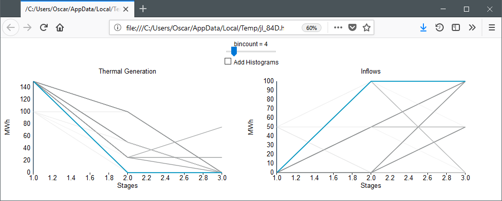

# Tutorial Seven: plotting

In our previous tutorial, we have formulated, solved, and simulated a multistage
stochastic optimization problem. However, we haven't really investigated what
the solution looks like. Luckily, SDDP.jl includes a number of plotting tools to
help us do that. In this tutorial, we explain the tools and make some pretty
pictures.

First, recall from [Tutorial Six: cut selection](@ref) that our model is:
```julia
m = SDDPModel(
                  sense = :Min,
                 stages = 3,
                 solver = ClpSolver(),
        objective_bound = 0.0,
      markov_transition = Array{Float64, 2}[
          [ 1.0 ]',
          [ 0.75 0.25 ],
          [ 0.75 0.25 ; 0.25 0.75 ]
      ],
           risk_measure = EAVaR(lambda=0.5, beta=0.1),
             cut_oracle = LevelOneCutOracle()
                                        ) do sp, t, i
    @state(sp, 0 <= outgoing_volume <= 200, incoming_volume == 200)
    @variables(sp, begin
        thermal_generation >= 0
        hydro_generation   >= 0
        hydro_spill        >= 0
    end)
    @rhsnoise(sp, inflow = [0.0, 50.0, 100.0],
        outgoing_volume - (incoming_volume - hydro_generation - hydro_spill) == inflow
    )
    @constraints(sp, begin
        thermal_generation + hydro_generation == 150
    end)
    fuel_cost = [50.0, 100.0, 150.0]
    @stageobjective(sp, mupliplier = [1.2, 1.0, 0.8],
        mupliplier * fuel_cost[t] * thermal_generation
    )
    if i == 1  # wet climate state
        setnoiseprobability!(sp, [1/6, 1/3, 0.5])
    else       # dry climate state
        setnoiseprobability!(sp, [0.5, 1/3, 1/6])
    end
end
```

We're going to solve this for 20 iterations and then simulate 100 Monte Carlo
realizations of the solution.
```julia
status = solve(m, iteration_limit = 20)
simulation_result = simulate(m,
    100,
    [:outgoing_volume, :thermal_generation, :hydro_generation, :hydro_spill]
)
```

## Plotting the simulated trajectories

```julia
inflows = [0.0, 50.0, 100.0]
plt = SDDP.newplot()
SDDP.addplot!(plt,
    1:100, 1:3,
    (i, t)->simulation_result[i][:thermal_generation][t],
    title  = "Thermal Generation",
    ylabel = "MWh"
)
SDDP.addplot!(plt,
    1:100, 1:3,
    (i, t)->inflows[simulation_result[i][:noise][t]],
    title  = "Inflows",
    ylabel = "MWh"
)
SDDP.show(plt)
```

This should open a plot window with a plot that looks like:


Using the mouse, you can highlight individual trajectories by hovering over
them. This makes it possible to visualize a single trajectory across multiple
dimensions. In the above plot, we are hovering over the highest thermal
generation trajectory. As could be expected, this occurs when the inflow is 0 in
every stage.

If you click on the plot, then trajectories that are close to the mouse pointer
are shown darker and those further away are shown lighter. In the following
image, we clicked on the high thermal generation point in the first stage. This
shows that thermal generation is high when inflows are low.



## Publication quality plots

Instead of the interactive Javascript plots, you can also create some
publication ready plots using the `SDDP.publicationplot` function.

!!! note
    You need to install the [Plots.jl](https://github.com/JuliaPlots/Plots)
    package for this to work. We used the `GR` backend (`gr()`), but any
    Plots.jl backend should work.

This function implements a plot recipe to create ribbon plots of each variable
against the stages. The first argument is the vector of simulation dictionaries
and the second argument is the dictionary key that you want to plot. Standard
Plots.jl keyword arguments such as `title` and `xlabel` can be used to modify
the look of each plot. By default, the plot displays ribbons of the 0-100,
10-90, and 25-75 percentiles. The dark, solid line in the middle is the median
(i.e. 50'th percentile).

```julia
using Plots
gr()
plot(
    SDDP.publicationplot(simulation_result, :outgoing_volume, title="Volume"),
    SDDP.publicationplot(simulation_result, :thermal_generation, title="Thermal Generation"),
    SDDP.publicationplot(simulation_result, :hydro_generation, title="Hydro Generation"),
    SDDP.publicationplot(simulation_result, :hydro_spill, title="Hydro Spill"),
    layout        = (2,2),
    size          = (1000, 600),
    titlefont     = Plots.font("times", 14),
    guidefont     = Plots.font("times", 14),
    tickfont      = Plots.font("times", 14),
    bottom_margin = 7.5Plots.mm,
    left_margin   = 5Plots.mm,
    xlabel        = "Stage\n",
    xticks        = [1,2,3]
)
```

This should open a plot window with a plot that looks like:


You can save this to a PDF using Plots.jl
```julia
savefig("my_picture.pdf")
```

## Plotting the value function

It is often of interest to examine the shape of the cost-to-go function. SDDP.jl
facilitates this with [`SDDP.plotvaluefunction`](@ref). It requires at least
four inputs. The first is the SDDPModel `m`, the second is the index of the
stage, and the third is the index of the Markov state. The remaining arguments
define a set of discretized points at which to evaluate the cost-to-go function.
The fourth argument gives the set of points at which to evaluate the first state
variable, the fifth argument gives the points for the second state variable (if
one exists), and so on.

For our example, there is only one state variable, so to visualize it over the
range of `0:200` in the wet Markov state in the second stage, we call:
```julia
SDDP.plotvaluefunction(m, 2, 1, 0.0:200.0; label1="Volume")
```
This should open a browser window with a plot that looks like:


[`SDDP.plotvaluefunction`](@ref) can also be used to visualize problems with
multiple state dimensions. For example, if we had three reservoirs, we can fix
the second reservoir to `100.0` units and then visualize the cost-to-go surface
with respect to the two free dimensions:
```julia
SDDP.plotvaluefunction(m, 2, 1,
    0.0:1:200.0,
    100.0,
    0.0:1:200.0;
    label1="First State",
    label2="Third State"
)
```

That concludes our seventh tutorial for SDDP.jl. In our next tutorial,
[Tutorial Eight: odds and ends](@ref), we  discuss some odds and ends relating
to SDDP now that we have a basic  understanding of it's functionality.
