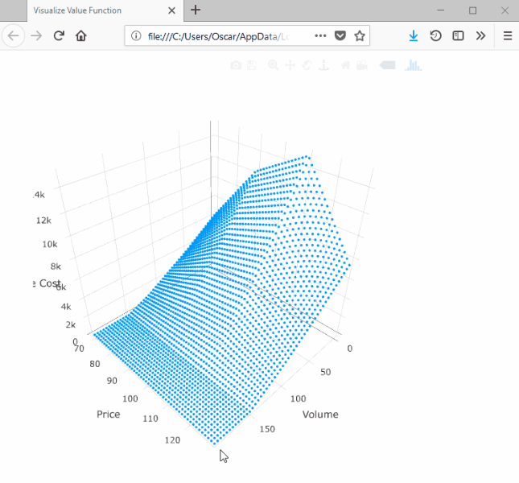

# Tutorial Twelve: price interpolation

There are many applications in which we want to model a price process that
follows some auto-regressive process. Common examples include stock prices on
financial exchanges and spot-prices in energy markets. However, it is well known
that these cannot be incorporated in to SDDP because they result in cost-to-go
functions that are convex with respect to some state variables (e.g., the
reservoir levels) and concave with respect to other state variables (e.g., the
spot price in the current stage). To overcome this problem, the approach in the
literature has been to discretize the price process in order to model it using a
Markovian policy graph like those discussed in [Tutorial Four: Markovian policy graphs](@ref).

However, recent work offers a way to include *stagewise-dependent* objective
uncertainty into the objective function of SDDP subproblems. Readers are
directed to the following works for an introduction:
 - Downward, A., Dowson, O., and Baucke, R. (2017). Stochastic dual dynamic
   programming with stagewise dependent objective uncertainty.
   [Optimization Online](http://www.optimization-online.org/DB_HTML/2018/02/6454.html).
 - Dowson, O. PhD Thesis. University of Auckland, 2018. [link](../assets/dowson_thesis.pdf)

In [Tutorial Five: risk](@ref), we formulated a risk-averse version of the
hydrothermal scheduling problem. In this tutorial, we extend that model to the
case where the fuel cost follows the log auto-regressive process:
 ```
 log(fuel_cost[t]) = log(fuel_cost[t-1]) + log(noise)
```
where `noise` is drawn from the sample space `[0.9, 1.0, 1.1]` with equal
probability.

To model this in SDDP.jl, we can pass a [`DynamicPriceInterpolation`](@ref)
object to the `value_function` keyword in [`SDDPModel`](@ref).
[`DynamicPriceInterpolation`](@ref) takes a number of arguments. First, we need
to pass `dynamics` a function that takes two inputs -- the value of the price
state in the previous stage and an instance of the  noise -- and returns value
of the price state for the current stage. For example, the dynamics of our price
process are:
```julia
function fuel_cost_dynamics(fuel_cost, noise)
    return noise * fuel_cost
end
```
We also need to specify the distribution of the noise term. We do this by
passing a [`DiscreteDistribution`](@ref) to the `noise` keyword.
[`DiscreteDistribution`](@ref) takes two arguments: the first is a vector of
realizations, and the second is a corresponding vector of probabilities. For our
example, we create the noise distribution as:
```julia
noise = DiscreteDistribution( [0.9, 1.0, 1.1], [1/3, 1/3, 1/3] )
```
It is the realizations of the noise `0.9`, `1.0`, or `1.1` that are passed as
`noise` to `fuel_cost_dynamics`.

We also need to pass the value of the price state in the root node to
`initial_price`, as well as the minimum (to `min_price`) and maximum (to
`max_price`) possible values of the price state variable.

Finally, we need to declare a `lipschitz_constant`. In each stage, the
`lipschitz_constant` should be larger than the maximum possible absolute change
in the cost-to-go function given a one-unit change  in the value of the price
state variable. For example, in our model, the worst-case scenario is if we are
forced to use thermal generation exclusively. In that case, we need to supply
450 MWh of energy. Therefore, a one-unit change in the value of the price-state
can, at most, lead to a \$450 change in the cost-to-go function. However, to be
on the safe side, we choose a larger value of `1000.0`.

Putting all of this together, we can initialize the [`SDDPModel`](@ref) using
dynamic interpolation as:
```julia
m = SDDPModel(
    # ... arguments omitted ...
    value_function = DynamicPriceInterpolation(
        dynamics           = fuel_cost_dynamics,
        noise              = DiscreteDistribution([0.9, 1.0, 1.1], [1/3, 1/3, 1/3]),
        initial_price      = 100.0,
        min_price          =  50.0,
        max_price          = 150.0,
        lipschitz_constant = 1000.0
    )
        do sp, t
    # ... subproblem definition ...
end
```

In the subproblem definition, we use a different version of the
[`@stageobjective`](@ref) function. This version takes a function that maps the
price in the current stage to an expression for the stage objective. For our
example, the stage-objective is:
```julia
 @stageobjective(sp, (fuel_cost) -> fuel_cost * thermal_generation )
```

The next question is how to extend this notation to models in which the price
process depends upon the stage or Markov state. This can be implemented in
SDDP.jl following a similar approach to that we discussed in
[Stage-dependent risk measures](@ref). Instead of passing an instance of
`DynamicPriceInterpolation`, we pass a function that takes two arguments -- the
stage `t` and Markov state `i` -- and returns an instance of
`DynamicPriceInterpolation`. For our example, if the price is deterministic in
the first stage:
```julia
function build_price_interpolation(t::Int, i::Int)
    noise = if t == 1
        DiscreteDistribution([1.0], [1.0])
    else
        DiscreteDistribution([0.9, 1.0, 1.1], [1/3, 1/3, 1/3])
    end
    DynamicPriceInterpolation(
        dynamics           = fuel_cost_dynamics,
        initial_price      = 100.0,
        min_price          =  50.0,
        max_price          = 150.0,
        noise              = noise,
        lipschitz_constant = 1000.0
    )
end
```

Putting all this together, our model is:
```julia
m = SDDPModel(
    sense             = :Min,
    stages            = 3,
    solver            = ClpSolver(),
    objective_bound   = 0.0,
    markov_transition = Array{Float64, 2}[
        [ 1.0 ]',
        [ 0.75 0.25 ],
        [ 0.75 0.25 ; 0.25 0.75 ]
    ],
    risk_measure      = EAVaR(lambda=0.5, beta=0.1),
    value_function    = build_price_interpolation
                                        ) do sp, t, i
    @state(sp, 0 <= outgoing_volume <= 200, incoming_volume == 200)
    @variables(sp, begin
        thermal_generation >= 0
        hydro_generation   >= 0
        hydro_spill        >= 0
    end)
    @rhsnoise(sp, inflow = [0.0, 50.0, 100.0],
        outgoing_volume - (incoming_volume - hydro_generation - hydro_spill) == inflow
    )
    @constraints(sp, begin
        thermal_generation + hydro_generation == 150
    end)
    @stageobjective(sp, (fuel_cost) -> fuel_cost * thermal_generation )
    if i == 1  # wet climate state
        setnoiseprobability!(sp, [1/6, 1/3, 0.5])
    else       # dry climate state
        setnoiseprobability!(sp, [0.5, 1/3, 1/6])
    end
end
```

Now we can solve this model as usual.
```julia
status = solve(m; iteration_limit=100)
```
When we simulate the policy, we can include the extra key `:price`, which
records the value of the price state in each stage. For example:
```julia
simulation_result = simulate(m, 100,
    [:outgoing_volume, :thermal_generation, :hydro_generation, :hydro_spill, :price]
)
```

We can check that the price follows the auto-regressive process:
```julia
julia> simulation_result[1][:price]
 100.0
  90.0
  99.0
```

We can also plot the cost-to-go function using [`SDDP.plotvaluefunction`](@ref)
like we discussed in [Tutorial Seven: plotting](@ref):
```julia
SDDP.plotvaluefunction(m, 2, 2,
    linspace(0, 200, 50),   # the reservoir volume
    linspace(70, 130, 50);  # the price state
    label1="Volume",
    label2="Price"
)
```
This will launch a browser window with the following:


Note that the surface is convex with respect to the volume dimension and concave
with respect to the price dimension.

That concludes our twelfth tutorial for `SDDP.jl`. In the next tutorial,
[Tutorial Thirteen: constraint noise](@ref), we discuss experimental support for
noise in the constraint matrix.
