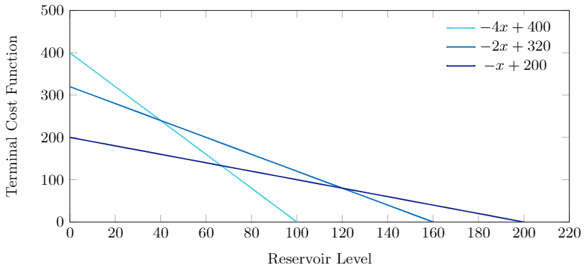

# Tutorial Eleven: infinite-horizon SDDP
This tutorial discusses discusses Infinite-Horizon Stochastic Dynamic Programming. The implementation of infinite-horizon SDDP uses the average cost method. Another possible method could be using the discounted cost method however this method converges much slower than the average cost method. Infinite-horizon SDDP finds the optimal steady state policy of the problem.

My Honors [thesis](https://github.com/shasafoster/SDDP.jl/blob/master/docs/src/assets/foster_thesis.pdf) may be useful for further understanding the underlying theory of Infinite-Horizon Stochastic Dynamic Programming. Ben Fulton applied infinite-horizon SDDP when modelling various scenarios in the New Zealand electricity market thus his [thesis](https://github.com/shasafoster/SDDP.jl/blob/master/docs/src/assets/fulton_thesis.pdf) may also be of interest. 

The differencs between infinite-horizon SDDP and SDDP will be explained by formulating and solving a multistage stochastic dynamic program with each method. 

## The Problem

Recall that our model for the hydrothermal scheduling problem  from
[Tutorial One: first steps](@ref) is:
```julia
m = SDDPModel(
                  sense = :Min,
                 stages = 3,
                 solver = ClpSolver(),
        objective_bound = 0.0
                                        ) do sp, t
    @state(sp, 0 <= outgoing_volume <= 200, incoming_volume == 200)
    @variables(sp, begin
        thermal_generation >= 0
        hydro_generation   >= 0
        hydro_spill        >= 0
     end)
    inflow = [50.0, 50.0, 50.0]
    @constraints(sp, begin
        incoming_volume + inflow[t] - hydro_generation - hydro_spill == outgoing_volume
        thermal_generation + hydro_generation == 150
    end)
    fuel_cost = [50.0, 100.0, 150.0]
    @stageobjective(sp, fuel_cost[t] * thermal_generation )
end
```

We will continue using the hydrothermal scheduling problem, the most common application of stochastic dual dynamic programming. 
However, the formualtion will be extended slightly

The difference between this formulation and the formulation used in previous tutorials is the presence of a terminal cost-to-go function. The terminal cost-to-go is an important part of more developed hydrothermal scheduling problems. 

In the context of hydrothermal sceduling the terminal cost is based on the concept of a marginal value of water. Water at the end-of-horizon has a value because it can be used to generate electricity. The water is said to have a *marginal* value because a m^3 of water is worth more to when the reservoir is empty compared to when our reseroivr is full.

The marginal water value function for this simple problem is shown in the chart below.


In the absence of a terminal cost-to-go function in the context of the hydrothermal sceduling problem the policy would leave the reservoir empty at the end of the final stage. As water in hydro reservoirs has value this outcome is undesirable and would not happen in reality. A terminal cost-to-go function is used to penalise such action. A terminal cost, which is a function of the final reserovir levels at the end of the final stage is included in the terminal stage objective. 

The terminal cost function, constructed from the marginal water value function used in the simple example is shown in the chart below:




## Formulating and solving the problem with SDDP

Now that the marginal water value and terminal cost function have been explained we can construct the model of the problem.
comapred to the simple hydrothermal scheduling problem

```julia
using SDDP, JuMP, Clp

m = SDDPModel(
                 sense = :Min,
                 stages = 3,
                 solver = ClpSolver(),
                 objective_bound = 0.0) do sp, t

    @state(sp, 0 <= outgoing_volume <= 200, incoming_volume == 200)
    @variables(sp, begin
        thermal_generation >= 0
        hydro_generation   >= 0
        hydro_spill        >= 0
        terminalcost       >= 0
     end)

    inflow = [50.0, 50.0, 50.0]
    fuel_cost = [50.0, 100.0, 150.0]
    terminal_marginal_cost = [-3 -2 -1]
    intercept = 600

    @constraints(sp, begin
        incoming_volume + inflow[t] - hydro_generation - hydro_spill == outgoing_volume
        thermal_generation + hydro_generation == 150
    end)
    for i in 1:length(terminal_marginal_cost)
        @constraint(sp, terminalcost >= terminal_marginal_cost[i] * outgoing_volume + intercept)
    end

    if t < 3
        @stageobjective(sp, fuel_cost[t] * thermal_generation)
    elseif t == 3
        @stageobjective(sp, fuel_cost[t] * thermal_generation + terminalcost)
    end
end

```
To solve this problem, we use the solve method:
```julia
status = solve(m; iteration_limit=5)
```

The output from the log is:
```
-------------------------------------------------------------------------------
                          SDDP.jl © Oscar Dowson, 2017-2018
-------------------------------------------------------------------------------
    Solver:
        Serial solver
    Model:
        Stages:         3
        States:         1
        Subproblems:    3
        Value Function: Default
-------------------------------------------------------------------------------
              Objective              |  Cut  Passes    Simulations   Total
     Simulation       Bound   % Gap  |   #     Time     #    Time    Time
-------------------------------------------------------------------------------
       15.600K         5.400K        |     1    0.0      0    0.0    0.0
        5.996K         5.600K        |     2    0.0      0    0.0    0.0
        5.600K         5.600K        |     3    0.0      0    0.0    0.0
        5.600K         5.600K        |     4    0.0      0    0.0    0.0
        5.600K         5.600K        |     5    0.0      0    0.0    0.0
-------------------------------------------------------------------------------
    Other Statistics:
        Iterations:         5
        Termination Status: iteration_limit
===============================================================================
```


# Formulating the problem with infinite-horizon SDDP
In formulating many stochastic dynamic programs, a terminating cost-to-go function is necessary. However, this terminating cost-to-go function is an assumption of many fomulations. Solving a multi-stage stochastic dynamic problem with infinite-horizon stochastic dynamic programming (infinite-horizon SDDP), eliminates the need for a terminating cost-to-go function. 

```
using SDDP, JuMP, Clp
m = SDDPModel(
                 sense = :Min,
                 stages = 3,
                 solver = ClpSolver(),
                 objective_bound = 0.0,
                 is_infinite = true,
                 lb_states = [0],
                 ub_states = [200]) do sp, t

    if t > 0
        @state(sp, 0 <= outgoing_volume <= 200, incoming_volume == 200)
        @variables(sp, begin
            thermal_generation >= 0
            hydro_generation   >= 0
            hydro_spill        >= 0
            terminalcost       >= 0
         end)

        inflow = [50.0, 50.0, 50.0]
        fuel_cost = [50.0, 100.0, 150.0]

        @constraints(sp, begin
            incoming_volume + inflow[t] - hydro_generation - hydro_spill == outgoing_volume
            thermal_generation + hydro_generation == 150
        end)

        @stageobjective(sp, fuel_cost[t] * thermal_generation)
    else
        @state(sp, 0 <= outgoing_volume <= 200, incoming_volume == 200)
    end

end
```

To solve this problem, we use the solve method. The additional parameter ```update_limit``` is required to be passed to the solve function when using infinite-horizon SDDP. Choosing the values for ```iteration_limit``` and ```update_limit``` is more of an art than a science. 

For example, for a complex hydrothermal sceduling problem modelled with SDDP (with an exogenous terminal cost function), 3000 iterations of SDDP may be needed for convergence. When solving this problem with SDDP.jl we would set ```iteration_limit = 3000```.

However, when the same problem is solved with infinite-horizon SDDP a total of 8000 iterations of SDDP may be needed because the endogenous terminal cost-to-go function needs to converge. From my experience we choose ```iteration_limit = 500``` and ```update_limit = 20``` (500x16 = 8000 total iteration of SDDP). Choosing the values for ```iteration limit``` and ```update limit``` is discused furhter in Section 5 of my [thesis](https://github.com/shasafoster/SDDP.jl/blob/master/docs/src/assets/foster_thesis.pdf). 

For a given problem usually solved with 

```julia
status = solve(m; iteration_limit=5, update_limit=10)
```

The output from the log is:

```
-------------------------------------------------------------------------------
                          SDDP.jl © Oscar Dowson, 2017-2018
-------------------------------------------------------------------------------
    Solver:
        Serial solver
    Model:
        Stages:         4
        States:         1
        Subproblems:    4
        Value Function: Default
-------------------------------------------------------------------------------
              Objective              |  Cut  Passes    Simulations   Total
     Simulation       Bound   % Gap  |   #     Time     #    Time    Time
-------------------------------------------------------------------------------
        5.000K        17.500K        |     1    0.0      0    0.0    0.0
       22.500K        35.000K        |     2    0.0      0    0.0    0.0
       22.500K        35.000K        |     3    0.0      0    0.0    0.0
       22.500K        35.000K        |     4    0.0      0    0.0    0.0
       22.500K        35.000K        |     5    0.0      0    0.0    0.0
-------------------------------------------------------------------------------
    Other Statistics:
        Iterations:         5
        Termination Status: iteration_limit
===============================================================================

This concludes our tutorial 12 for SDDP.jl on infinite-horizon SDDP. 
