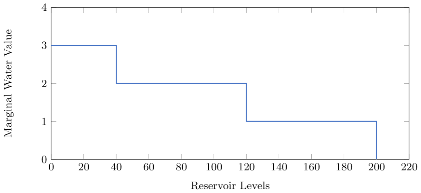

# Tutorial Eleven: infinite-horizon SDDP
This tutorial discusses the use of infinite-horizon stochastic dynamic dual programming (infinite-horizon SDDP). Infinite-horizon SDDP is a methodology for finding the optimal steady state policy of a multi-stage stochastic problem.

We implemented infinite-horizon SDDP using the average-cost method. Another possible method could be using the discounted-cost method however this method converges slower (than the average-cost method).

My Honors [thesis](https://github.com/shasafoster/SDDP.jl/blob/master/docs/src/assets/foster_thesis.pdf) may be useful for further understanding of the underlying theory of infinite-horizon SDDP. Ben Fulton applied infinite-horizon SDDP when modelling various scenarios in the New Zealand electricity market thus his [thesis](https://github.com/shasafoster/SDDP.jl/blob/master/docs/src/assets/fulton_thesis.pdf) may also be of interest. 

The differences between infinite-horizon SDDP and standard SDDP will be explained by formulating and solving a multistage stochastic dynamic program with each method. 

## The Problem

Recall that our model for the hydrothermal scheduling problem  from
[Tutorial Two: RHS noise](@ref) is:
```julia
m = SDDPModel(
                  sense = :Min,
                 stages = 3,
                 solver = ClpSolver(),
        objective_bound = 0.0
                                        ) do sp, t
    @state(sp, 0 <= outgoing_volume <= 200, incoming_volume == 200)
    @variables(sp, begin
        thermal_generation >= 0
        hydro_generation   >= 0
        hydro_spill        >= 0
    end)
    @rhsnoise(sp, inflow = [0.0, 50.0, 100.0],
        outgoing_volume - (incoming_volume - hydro_generation - hydro_spill) == inflow
    )
    setnoiseprobability!(sp, [1/3, 1/3, 1/3])
    @constraints(sp, begin
        thermal_generation + hydro_generation == 150
    end)
    fuel_cost = [50.0, 100.0, 150.0]
    @stageobjective(sp, fuel_cost[t] * thermal_generation )
end
```

We will continue using this simple example of the hydrothermal scheduling problem. However, the formulation will be slightly extended.

We will add a terminal cost-to-go function to the formulation. The terminal cost-to-go is an important part of developed hydrothermal scheduling problems. 

In the context of hydrothermal scheduling, the terminal cost is based on the concept of a marginal value of water. Water at the end-of-horizon has value because it can be used to generate electricity. The water is said to have a *marginal* value because a m^3 of water is worth more to when the reservoir is empty compared to when our reservoir is full.

The marginal water value function for this simple problem is shown in the chart below.



In the absence of a terminal cost-to-go function in the context of the hydrothermal scheduling problem, the policy would leave the reservoir empty at the end of the final stage. As water in hydro reservoirs has value, this outcome is undesirable and would not happen in reality. A terminal cost-to-go function is used to penalise such action. A terminal cost, which is a function of the final reservoir levels at the end of the final stage is included in the terminal stage objective. 

The terminal cost function, constructed from the marginal water value function used in the simple example is shown in the chart below:


## Formulating and solving the problem with SDDP

Now that the marginal water value and terminal cost function have been explained we can construct the model of the problem.

Compared to the simple hydrothermal scheduling problem presented in [Tutorial Two: RHS noise](@ref) there is an additional term in the objective in the final stage, the terminal cost.

```julia
using SDDP, JuMP, Clp


m = SDDPModel(
                  sense = :Min,
                 stages = 3,
                 solver = ClpSolver(),
        objective_bound = 0.0
                                        ) do sp, t
    @state(sp, 0 <= outgoing_volume <= 200, incoming_volume == 200)
    @variables(sp, begin
        thermal_generation >= 0
        hydro_generation   >= 0
        hydro_spill        >= 0
        terminalcost       >= 0
     end)
    @rhsnoise(sp, inflow = [0.0, 50.0, 100.0],
        outgoing_volume - (incoming_volume - hydro_generation - hydro_spill) == inflow
    )
    setnoiseprobability!(sp, [1/3, 1/3, 1/3])
    
    terminal_marginal_cost = [-3 -2 -1]
    intercept = 600
    fuel_cost = [50.0, 100.0, 150.0]
    
    @constraints(sp, begin
        thermal_generation + hydro_generation == 150
    end)
    
    for i in 1:length(terminal_marginal_cost)
        @constraint(sp, terminalcost >= terminal_marginal_cost[i] * outgoing_volume + intercept)
    end

    if t < 3
        @stageobjective(sp, fuel_cost[t] * thermal_generation)
    elseif t == 3
        @stageobjective(sp, fuel_cost[t] * thermal_generation + terminalcost)
    end
end

```
To solve this problem, we use the solve method:
```julia
status = solve(m; iteration_limit=5)
```

The output from the log is:
```

```

Including a terminal cost has increased the minimal policy cost from `5.0K` to `5.6K`. This additional cost of `0.6K` is due to the addition of the terminal cost in the final stage objective.   


## Formulating the problem with infinite-horizon SDDP
In formulating many stochastic dynamic programs (such as the previous example), a terminating cost-to-go function is necessary. However, this terminating cost-to-go function is an assumption of many formulations, including the previous example. Solving a multi-stage stochastic problem with infinite-horizon stochastic dynamic programming eliminates the need for a terminal cost function. 

The problem is constructed similarly to the problem in [Tutorial One: first steps](@ref). 
The only difference is in the input to [`SDDPModel`](@ref) method. The flag `is_infinite = true` tells [`SDDPModel`](@ref) to build the model using infinite-horizon SDDP. 

The additional inputs `lb_states` and `ub_states` provide the lower bound and upper bound on the state in stage 1 of the problem and are **required** inputs when using infinite-horizon SDDP.

```julia
m = SDDPModel(
                 sense = :Min,
                stages = 3,
                solver = ClpSolver(),
       objective_bound = 0.0,
           is_infinite = true,
             lb_states = [0],
             ub_states = [200]) do sp, t
```


```julia
using SDDP, JuMP, Clp
m = SDDPModel(
                 sense = :Min,
                stages = 3,
                solver = ClpSolver(),
       objective_bound = 0.0,
           is_infinite = true,
             lb_states = [0],
             ub_states = [200]) do sp, t
             
    @state(sp, 0 <= outgoing_volume <= 200, incoming_volume == 200)
    @variables(sp, begin
        thermal_generation >= 0
        hydro_generation   >= 0
        hydro_spill        >= 0
    end)
    @rhsnoise(sp, inflow = [0.0, 50.0, 100.0],
        outgoing_volume - (incoming_volume - hydro_generation - hydro_spill) == inflow
    )
    setnoiseprobability!(sp, [1/3, 1/3, 1/3])
    @constraints(sp, begin
        thermal_generation + hydro_generation == 150
    end)
    fuel_cost = [50.0, 100.0, 150.0]
    @stageobjective(sp, fuel_cost[t] * thermal_generation )
end
```

To solve this problem, we use the [`solve`](@ref) method. The additional parameter `update_limit` is required to be passed to the solve function when using infinite-horizon SDDP. Choosing the values for `iteration_limit` and `update_limit` is more of an art than a science. 

For example, for a complex hydrothermal scheduling problem modelled with SDDP (with an exogenous terminal cost function), 3000 iterations of SDDP may be needed for convergence. When solving this problem with SDDP.jl, we would set `iteration_limit = 3000`. 

However, when the same problem is solved with infinite-horizon SDDP, a total of 8000 iterations of SDDP may be needed because the endogenous terminal cost-to-go function needs to converge. From my experience, we choose `iteration_limit = 500` and `update_limit = 16` (500x16 = 8000 total iteration of SDDP). Choosing the values for `iteration_limit` and `update limit` is discussed further in Section 5 of my [thesis](https://github.com/shasafoster/SDDP.jl/blob/master/docs/src/assets/foster_thesis.pdf). 

For this simple problem we solve the model with the `iteration_limit=5`, `update_limit=10`.
```julia
status = solve(m; iteration_limit=5, update_limit=10)
```

The output from the final update (update 10/10) log is:
```
-------------------------------------------------------------------------------
                          SDDP.jl © Oscar Dowson, 2017-2018
-------------------------------------------------------------------------------
    Solver:
        Serial solver
    Model:
        Stages:         3
        States:         1
        Subproblems:    3
        Value Function: Default
-------------------------------------------------------------------------------
              Objective              |  Cut  Passes    Simulations   Total
     Simulation       Bound   % Gap  |   #     Time     #    Time    Time
-------------------------------------------------------------------------------
       17.500K        30.638K        |     1    0.0      0    0.0    0.0
       20.000K        30.638K        |     2    0.0      0    0.0    0.0
       15.000K        30.638K        |     3    0.0      0    0.0    0.0
       17.500K        34.026K        |     4    0.0      0    0.0    0.0
       10.000K        30.638K        |     5    0.0      0    0.0    0.0
       22.500K        38.470K        |     6    0.0      0    0.0    0.0
       22.500K        30.638K        |     7    0.0      0    0.0    0.0
       12.500K        30.638K        |     8    0.0      0    0.0    0.0
       17.500K        34.026K        |     9    0.0      0    0.0    0.0
       17.500K        34.026K        |    10    0.0      0    0.0    0.0
-------------------------------------------------------------------------------
    Other Statistics:
        Iterations:         10
        Termination Status: iteration_limit
===============================================================================
elapsed time: 0.049169595 seconds
-------------------------------------------------------------------------------
Iteration  Time (s)   Bound      Delta      sd(delta)    Terminal Cost Integral
    1       0.00     25.278K
    2       0.00     43.066K     22.634K    523.991       0.000
    3       0.00     31.054K     22.857K    238.919       0.000
    4       0.00     38.105K     23.024K    138.519       0.000
    5       0.00     33.861K     23.088K     86.170       0.000
    6       0.00     38.295K     23.103K    103.941       0.000
    7       0.00     33.920K     23.146K     77.417       0.000
    8       0.00     38.432K     23.229K     22.377       0.000
    9       0.00     34.018K     23.247K     13.158       0.000
   10       0.00     34.026K     23.252K      7.425       0.000
Net runtime (minutes): 0
-------------------------------------------------------------------------------

```

Notice how the objective `Bound` is higher than the `Simulation` objective. This due to the when solving the problem with infinite-horizon SDDP overshoots the objective. The expected cost of the policy is more accurately shown through the value of Delta (the method of computing Δ is discussed in my [thesis](https://github.com/shasafoster/SDDP.jl/blob/master/docs/src/assets/foster_thesis.pdf)).

Note how the `Bound Objective - Delta = Simulation Objective`.

This concludes our tutorial 12 for SDDP.jl on infinite-horizon SDDP. 
 
## To do:

### Hold cuts in memory
The current infinite-horizon methodology uses cuts written to a temporty directory (SDDP/src/temp/) vs holding the cuts in memory. Holding cuts in memory may result in faster solving, especially is `update_limit` is relatively large and `iteration_limit` is relatively small. 

### User-defined function to increase information value of the bound and simulation objective values
Given the `Simulation Objective` and the `Bound Objective` is less informative in the infinite-horizon programming, we output the Δ values as well. The values for Δ conveges as the policy converges. 

However, a user defined function that takes the initial `state` in the given iteration of SDDP as the input and applies the user-defined function to produce a string output would be useful in increasing the information value of the bound and simulation objective values procued from each iteration of SDDP.

For example for the hydrothermal sceduling problem, the `state` is commonly multi-dimensional. Let the state may be a vector of length 5 representing 5 reservoirs. The user defined function may multiply each of the of the vector entries by a specific power unique to each reservoir. This specific power converts the amount stored water in the each reservoir (m^3) to the amount stored hydroelectric energy (GWh) in each reservoir. The stored hydroelectric energies in each reservoir are summed to produce the net hydroelectric energy across the system. 

This value can then be written to the console with the `Simulation Objective` and the `Bound Objective` to inform these values. 

```julia
function write_informative_string(state::State)
    # do stuff with state
    return string
end
```

